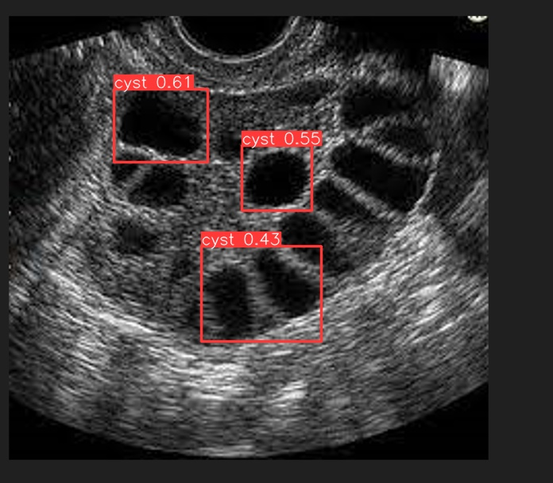

<div align="center">
  <h1>PCOSense: An AI-Powered Web Tool for PCOS Detection</h1>
  <strong>A full-stack application demonstrating the integration of a YOLOv8 model into a user-friendly Flask web interface for medical image analysis.</strong>
  <br />
  <br />
  
  <div>
    
    
    
    
  </div>
</div>

---

### 📋 <a name="table">Table of Contents</a>

1.  [🤖 Introduction](#introduction)
2.  [⚙️ Tech Stack](#tech-stack)
3.  [🔋 Features](#features)
4.  [📸 Application Showcase](#showcase)
5.  [📈 Architecture Flow](#architecture)
6.  [🤸 Quick Start](#quick-start)
7.  [🕸️ Code Snippets](#snippets)
8.  [🧠 Challenges & Learnings](#learnings)

---

### <a name="introduction">🤖 Introduction</a>

PCOSense is a web application that leverages a custom-trained **YOLOv8 object detection model** to analyze medical imagery. Built with a **Python and Flask** backend, this project provides a simple and intuitive interface for users to upload an ultrasound image and receive instant AI-powered analysis. The primary goal is to create a proof-of-concept tool that demonstrates how AI can augment diagnostic workflows, making them faster and more data-driven in the screening for Polycystic Ovarian Syndrome (PCOS).

This repository contains the complete source code, model weights, and assets for the project.

---

### <a name="tech-stack">⚙️ Tech Stack</a>

-   **Backend:** Python, Flask
-   **Machine Learning:** PyTorch, Ultralytics YOLOv8
-   **Image Processing:** OpenCV, Pillow
-   **Frontend:** HTML5, CSS3 (via Flask Templates)
-   **Web Server:** Gunicorn
-   **Version Control:** Git, GitHub

---

### <a name="features">🔋 Features</a>

👉 **Secure User Interface:** A multi-page web application with distinct sections for login, home, about, and the core image uploading functionality.

👉 **Simple Image Upload:** An intuitive interface for users to submit ultrasound images for analysis with a single click.

👉 **AI-Powered Detection:** Utilizes a custom-trained YOLOv8 model (`bestv8.pt`) to accurately identify and locate follicular cysts within the uploaded image.

👉 **Visual Feedback:** Displays the processed image with clear bounding boxes drawn around each detected cyst, providing immediate visual confirmation.

👉 **Quantitative Results:** Calculates and presents the total count of detected cysts, offering a key metric for assessment.

👉 **Modular & Reusable Code:** The application is structured with separate modules for the Flask web server (`main.py`) and the core AI detection logic (`detect.py`), ensuring the code is clean, reusable, and easy to maintain.

---

### <a name="showcase">📸 Application Showcase</a>

Since a live deployment on a free tier is challenging due to the high memory requirements of the AI model, the following screenshot demonstrates the application's full functionality and user interface as it runs locally.

#### **Before & After Detection**
*A side-by-side comparison showing the model's effectiveness.*
| Original Ultrasound Image | Image with AI Detections |
| :---: | :---: |
|  |  |

---

### <a name="architecture">📈 Architecture Flow</a>

The application architecture is designed for a streamlined user experience, handling everything from file reception to AI inference on the server side.

1.  **Image Upload:** The user selects and uploads an image through the Flask-rendered HTML frontend.
2.  **Backend Reception:** The Flask server receives the image file via a `POST` request to the `/result` endpoint.
3.  **AI Processing:** The server calls the `detect()` function, which loads the pre-trained `bestv8.pt` YOLOv8 model into memory.
4.  **Inference:** The model performs inference on the image, identifying the coordinates of all detected cysts.
5.  **Image Annotation:** An output image is generated with bounding boxes drawn around each detection.
6.  **Result Rendering:** The Flask server renders the result template, passing the path to the annotated image and the final cyst count to be displayed to the user.

---

### <a name="quick-start">🤸 Quick Start</a>

Follow these steps to set up and run the project locally on your machine.

**Prerequisites**

Make sure you have the following installed on your machine:
-   [Git](https://git-scm.com/)
-   [Python 3.8+](https://www.python.org/downloads/)
-   `pip` (Python Package Manager)

**Cloning the Repository**
```bash
git clone [https://github.com/sukijaa/PCOSense.git](https://github.com/sukijaa/PCOSense.git)
cd PCOSense